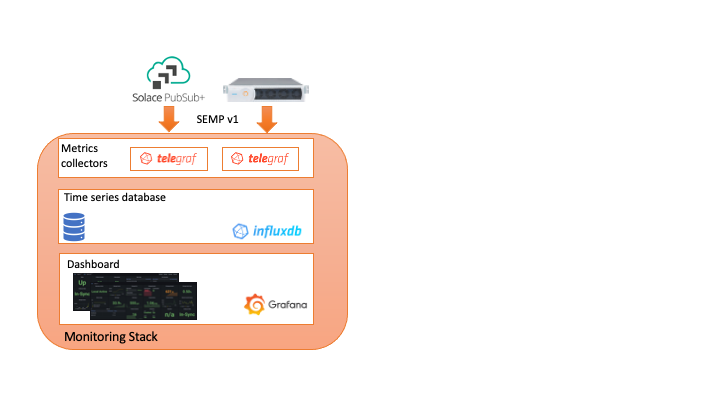
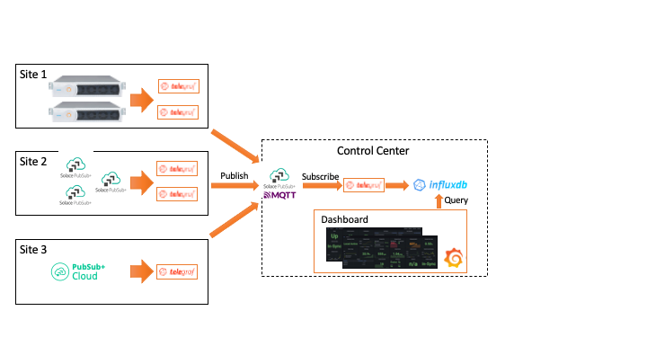
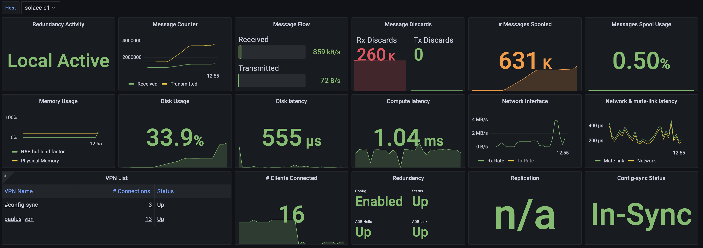
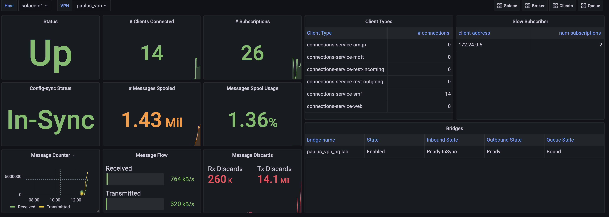
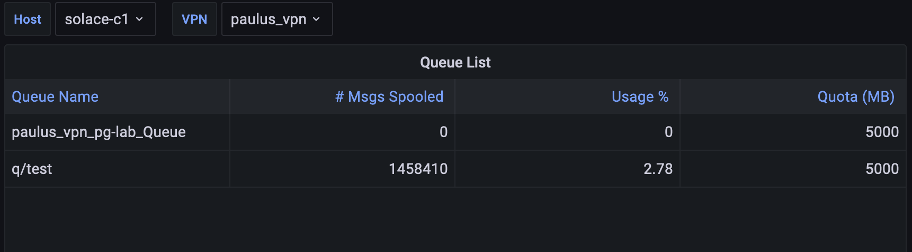

# Solace Custom Monitoring with Telegraf, Influxdb v2, and Grafana

## Overview
This repository contains example of Solace metrics monitoring with the these software stack:
- Telegraf: a metrics collector polling from SEMPv1 API. Each Solace host requires one telegraf agent.
- Influxdb v2: time-series database for storing metrics from Telegraf.
- Grafana: dashboard for metrics visualization



## Distributed Deployment
When there is a multi-sites monitoring, it is possible to consolidate metrics to a central site using a MQTT server



## Features
Telegraf can collect any metrics provided from Solace SEMPv1 API by parsing the XML using XPath. In this repository the following metrics are availble when using this (config)[./telegraf/telegraf_solace.conf]:
- Disk (Appliance)
- Storage Element (Software broker)
- System Health (Software broker)
- Memory
- Network Interface
- Global Stats (show stats client)
- Message VPN and stats
- Message-spool
- VPN's message-spool
- Bridge
- Redundancy
- Config-sync
- Replication
- Slow subscriber (may impact performance when there are many connected clients) 
- Client's subscriptions (may impact performance when there are many connected clients)
- Queues (may impact performance when there are many queues created)

A few samples of Grafana dashboards are avaiable:
### Broker Dashboard


### VPN Dashboard


### Queue Dashboard


Metrics collection from grafana can get any metrics provided from Solace SEMPv1 API. 

## Components Deployment
### InfluxDB v2
1. Install and configure [InfluxDB v2](https://docs.influxdata.com/influxdb/v2.1/install/) or use (container image)[https://hub.docker.com/_/influxdb]:`docker pull influxdb`
2. Start influxdb (service)[https://docs.influxdata.com/influxdb/v2.1/install/#start-influxdb]
3. Use (WebUI)[https://docs.influxdata.com/influxdb/v2.1/install/#set-up-influxdb-through-the-ui] or (CLI)[https://docs.influxdata.com/influxdb/v2.1/install/?t=CLI+Setup] to create and configure influx database. The next steps use CLI to configure influxdb.
4. Download and install (influx CLI)[https://docs.influxdata.com/influxdb/v2.1/tools/influx-cli/]
5. Initialize Influx Database:
```
influx setup --host http://<influxdb-ip>:8086 -u <new-admin-user> -p <new-admin-password> -o <organization-name> -b <bucket-name> -r <retention-hours>
```
Example:
```
influx setup --host http://127.0.0.1:8086 -u your-admin-user -p your-admin-password -o your.org -b solace -r 720
```
At the end of initializing, a bucket will be created in influxdb
6. Get the new bucket id and store in OS environment variable:
```
export BUCKET_ID=$(influx bucket list --hide-headers -n <bucket-name> | awk '{print $1}')
```
Example:
```
export BUCKET_ID=$(influx bucket list --hide-headers -n solace | awk '{print $1}')
```
7. Create a read permission token for Grafana:
```
influx auth create -o <organization-name> --read-bucket $BUCKET_ID
```
8. Create a write permission token for Telegraf:
```
influx auth create -o <organization-name> --write-bucket $BUCKET_ID
```

### Telegraf
1. Download and install (telegraf)[https://docs.influxdata.com/telegraf/v1.21/introduction/installation/] or use (container image)[https://hub.docker.com/_/telegraf]: `docker pull telegraf`
2. Configure telegraf at `/etc/telegraf/telegraf.conf`. Use this sample configuration for (Solace)[./telegraf/telegraf-solace.conf]
Below is a sample of `telegraf.conf`:
```
[agent]
  interval = "10s"
  round_interval = true
  metric_batch_size = 1000
  metric_buffer_limit = 10000
  collection_jitter = "0s"
  flush_interval = "10s"
  flush_jitter = "0s"
  precision = ""
  hostname = "$ROUTER_NAME"
  omit_hostname = false

[[outputs.influxdb_v2]]
  urls = ["http://influxdb:8086"]
  token = "$INFLUX_TOKEN"
  organization = "$INFLUX_ORG"
  bucket = "$INFLUX_BUCKET"

#show message-vpn *
[[inputs.http]]
  urls = [
    "$URL/SEMP"
  ]
  username = "$USER"
  password = "$PASSWORD"
  body = "<rpc><show><message-vpn><vpn-name>*</vpn-name></message-vpn></show></rpc>"
  insecure_skip_verify = true

  timeout = "5s"
  success_status_codes = [200]
  data_format = "xml"

  [[inputs.http.xml]]
    metric_selection = "/rpc-reply/rpc/show/message-vpn/child::vpn"
    metric_name = "string('vpn')"
    
    [inputs.http.xml.tags]
      message-vpn="name"

    [inputs.http.xml.fields_int]
      total-local-unique-subscriptions="total-local-unique-subscriptions"
      total-remote-unique-subscriptions="total-remote-unique-subscriptions"
      total-unique-subscriptions="total-unique-subscriptions"
      connections="connections"
      
    [inputs.http.xml.fields]
      enabled="boolean(enabled='true')"
      operational="boolean(operational='true')"
      locally-configured="boolean(locally-configured='true')"
      local-status="local-status"
```

3. Start Telegraf (service)[https://docs.influxdata.com/telegraf/v1.21/introduction/getting-started/#start-telegraf-service]

### Grafana
1. Install and configure (Grafana)[https://grafana.com/docs/grafana/latest/installation/] or use (container image)[https://hub.docker.com/r/grafana/grafana]: `docker pull grafana/grafana`
2. Configure (Influxdb data source)[https://grafana.com/docs/grafana/latest/datasources/influxdb/]
3. (Import)[https://grafana.com/docs/grafana/latest/dashboards/export-import/] dashboard from json files in (grafana folder)[./grafana]

## Deployment with Docker Compose
1. Reuse and modify the sample (docker-compose file)[./docker/docker-compose.yaml]. Assign the value of these environment variables:
- TZ: time-zone
- ROUTER_NAME: Solace broker hostname or routername
- URL: Solace SEMP URL (`[http|https]://<router-management-ip>[:port]`)
- USER: Solace management user with at least read-only permission
- PASSWORD: Solace user's password
- INFLUX_TOKEN: Influx write permission token. The token is to be created during (initialiation of influxdb)[#-InfluxDB-v2]
2. Follow the steps in (component deployment)[#components-deployment] to initialize Influxdb
3. Update (telegraf configuration file)[./telegraf/telegraf_solace.conf]

## Configuration Reference
1. (XPath[https://developer.mozilla.org/en-US/docs/Web/XPath]) for Telegraf XML parsing
2. (Query on Influx v2)[https://docs.influxdata.com/flux/v0.x/stdlib/]
